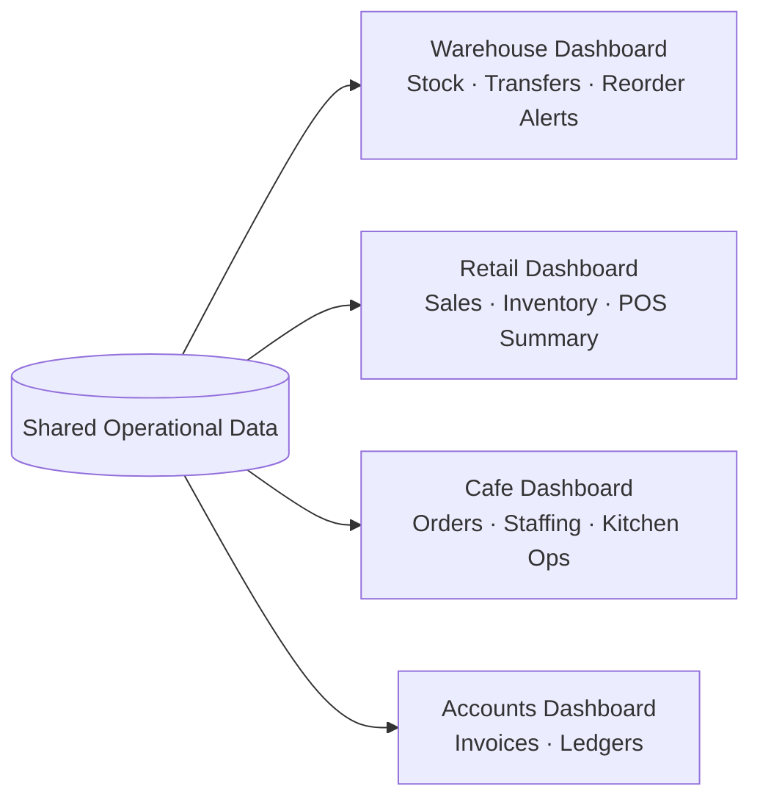
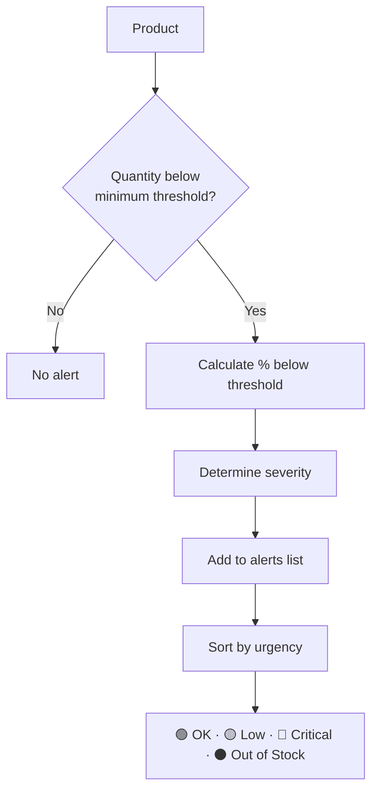

# Jodo — Project Implementation Tracker

# Features

This document covers what Jodo actually does — the four core features and what each one delivers to the user.

---

## 1. Customisable Dashboards

Users add, remove, and reorder panels according to their role. The same underlying data is reshaped into completely different views per person.



**What's configurable:**
- Which panels are shown
- Order of panels
- Per-role default layouts

---

## 2. Team Networking

A lightweight, built-in chat layer so operational alerts reach the right people without switching to Slack/WhatsApp and back.

**Example channels:**
- `#general`
- `#dispatch-alerts`
- `#low-stock-watch`

Alerts generated by the system (e.g. a critical stock alert) can be automatically posted into the relevant channel, keeping the whole team in sync without manual reporting.

---

## 3. AI Operations Agent

Users ask questions in plain language and the agent answers using live operational data — and can go a step further and take action.

### 3.1 What it can do

| Capability | Example |
|---|---|
| Answer questions | "Which products are going to run out before Friday?" |
| Flag risks | Surfaces critical stock before it becomes a stockout |
| Suggest actions | "Raise a reorder for SKU-1042" |
| Take action (with confirmation) | Actually raises the reorder, notifies a channel |

### 3.2 Example interaction

```
User:  Which products are going to run out before Friday?

Agent: Based on current transfer volume, 3 products are at risk:
       🔴 SKU-1042 (Steel Bolts)   — 2 days left
       🟡 SKU-2291 (Packing Tape) — 4 days left
       🟡 SKU-3310 (Gloves, L)    — 5 days left

       Suggested action: Raise a reorder for SKU-1042 today to avoid
       a stockout before Friday's dispatch.
       [Raise Reorder]  [Notify #low-stock-watch]
```

### 3.3 Chatbot vs Agent

A plain chatbot only answers questions. Jodo's AI is built as an **agent** — it can look things up itself and take actions, not just talk about them. See `IMPLEMENTATION.md` for exactly how this[...] 

---

## 4. Low-Stock Alert System

Jodo identifies products whose quantity falls below their minimum required quantity, and ranks them by urgency.



- Most urgent products are shown first on the dashboard.
- The AI agent uses this same severity logic when answering stock-related questions, so the dashboard and the agent never disagree on what's "critical."

---

## Feature Summary

| Feature | Solves |
|---|---|
| Customisable Dashboards | Information overload — everyone sees only what's relevant to their role |
| Team Networking | Constant tool-switching between ERP and chat apps |
| AI Operations Agent | Manually building reports to answer simple operational questions |
| Low-Stock Alert System | Stockouts caught too late |


---

## Team

| ID | Name | Role focus |
|---|---|---|
| P1 | [Name] | Project lead · Architecture · Documentation · Scalability |
| P2 | [Name] | Flask backend · Routes · Database · Odoo API |
| P3 | [Name] | Frontend · HTML/CSS · Jinja2 templates · UI logic |
| P4 | [Name] | Business logic · Algorithm · Testing · AI agent |

---

Jodo — Project Implementation Tracker (Extended + Required Details)

> **How to use this file**
> Update every row the moment a task changes state. Do not reconstruct history at the end.
> Every completed task must have a commit hash or file reference in the Evidence column.
> AI assistance must be recorded honestly — the student listed in *Completed By* is the person who reviewed, integrated, tested and verified the work.

---

## Team
@@ -123,6 +133,7 @@ flowchart TD
| In Progress | Started, not complete |
| Completed | Implemented and verified |
| Blocked | Cannot proceed — dependency documented |
| Deferred | Backlog / optional for now |
| Reopened | Found to contain a problem, needs rework |

---
@@ -134,12 +145,14 @@ flowchart TD
| Task ID | Task | Component | Assigned To | Status | Completed By | Date Completed | AI Assistance | Evidence |
|---|---|---|---|---|---|---|---|---|
| T001 | Create GitHub repository and add all members | Repo | P1 | Done | Prachi | — | No | — |
| T002 | Define and commit folder structure (`app.py`, `mock_data.py`, `templates/`, `static/`, `docs/`) | Repo | P1 | done | Prachi| — | No | — |
| T003 | Write `requirements.txt` with Flask, python-dotenv, requests | Repo | P2 | Done | Krina | 2026-08-29 | Yes | requirements.txt — commit 1a45d0c61426211c3750ac44de67460484bac516 |
| T004 | Write `.env.example` with `ANTHROPIC_API_KEY`, `ODOO_URL`, `ODOO_DB`, `ODOO_USERNAME`, `ODOO_PASSWORD` | Config | P2 | Done | Krina | 2026-08-29 | Yes | .env.example — commit 1a45d0c61426211c3750ac44de67460484bac516 |
| T002 | Define and commit folder structure (`app.py`, `mock_data.py`, `templates/`, `static/`, `docs/`) | Repo | P1 | Done | Prachi | — | No | — |
| T003 | Write `requirements.txt` with Flask, python-dotenv, requests | Repo | P2 | Done | Krina | 2026-08-29 | Yes | requirements.txt — commit 1a45d0c6 |
| T004 | Write `.env.example` with `ANTHROPIC_API_KEY`, `ODOO_URL`, `ODOO_DB`, `ODOO_USERNAME`, `ODOO_PASSWORD` | Config | P2 | Done | Krina | 2026-08-29 | Yes | .env.example — commit 1a45d0c6 |
| T005 | Write `README.md` with setup instructions (clone → venv → install → run) | Docs | P1 | Done | Vaibhavi and Prachi | — | Yes | — |
| T006 | Commit `docs/architecture.md` (existing document) | Docs | P1 | Done | Vaibhavi | — | No | — |
| T007 | Create this file (`docs/project-implementation.md`) and commit it | Docs | P1 | Done | Prachi | — | No | — |
| T008 | Initialize GitHub Actions CI (basic: lint + tests) | CI | P1 | Pending | — | — | No | — |
| T009 | Add `.gitignore`, CODEOWNERS and license | Repo | P1 | Done | Prachi | — | No | — |

---

@@ -149,17 +162,19 @@ flowchart TD

| Task ID | Task | Component | Assigned To | Status | Completed By | Date Completed | AI Assistance | Evidence |
|---|---|---|---|---|---|---|---|---|
| T008 | Write `mock_data.py` — `STOCK_LEVELS` list with fields: product, sku, location, qty, min_qty | Data | P4 | Done | Prachi | — | Yes | — |
| T009 | Write `mock_data.py` — `TRANSFERS` list with fields: ref, due, state, type, assigned_to | Data | P4 | Done | Prachi | — | Yes | — |
| T010 | Write `mock_data.py` — `CUSTOMERS` list with fields: name, email, orders, spent, status, segment | Data | P4 | Done | Prachi | — | Yes | — |
| T011 | Write `mock_data.py` — `SALES_ORDERS` list with fields: ref, customer, amount, status, date, items | Data | P4 | Done | Prachi | — | Yes | — |
| T012 | Write `mock_data.py` — `TEAM` list with fields: name, email, department, role, status | Data | P4 | Done | Prachi | — | Yes | — |
| T013 | Write `mock_data.py` — `NETWORK_POSTS` list with fields: author, role, content, likes, timestamp | Data | P4 | Pending | — | — | Yes | — |
| T014 | Design database schema — 6 tables: User, Product, StockLevel, Transfer, SalesOrder, TeamMember | Database | P2 | Pending | — | — | Yes | — |
| T015 | Draw ER diagram showing all 6 tables, attributes, primary keys and 5+ relationships | Database | P2 | Pending | — | — | Yes | — |
| T016 | Add ER diagram to `docs/architecture.md` | Docs | P1 | Pending | — | — | No | — |
| T017 | Set up SQLite database with SQLAlchemy — `db.py` with all 6 models defined | Database | P2 | Pending | — | — | Yes | — |
| T018 | Write database seed script — `seed.py` — populates DB from mock_data.py for local dev | Database | P2 | Pending | — | — | Yes | — |
| T010 | Write `mock_data.py` — `STOCK_LEVELS` list with fields: product, sku, location, qty, min_qty | Data | P4 | Done | Prachi | — | Yes | — |
| T011 | Write `mock_data.py` — `TRANSFERS` list with fields: ref, due, state, type, assigned_to | Data | P4 | Done | Prachi | — | Yes | — |
| T012 | Write `mock_data.py` — `CUSTOMERS` list with fields: name, email, orders, spent, status, segment | Data | P4 | Done | Prachi | — | Yes | — |
| T013 | Write `mock_data.py` — `SALES_ORDERS` list with fields: ref, customer, amount, status, date, items | Data | P4 | Done | Prachi | — | Yes | — |
| T014 | Write `mock_data.py` — `TEAM` list with fields: name, email, department, role, status | Data | P4 | Done | Prachi | — | Yes | — |
| T015 | Write `mock_data.py` — `NETWORK_POSTS` list with fields: author, role, content, likes, timestamp | Data | P4 | Pending | — | — | Yes | — |
| T016 | Design database schema — 6 tables: User, Product, StockLevel, Transfer, SalesOrder, TeamMember | Database | P2 | Pending | — | — | Yes | — |
| T017 | Add DB model: DashboardLayout — persist user/layout JSON | Database | P2 | Pending | — | — | Yes | — |
| T018 | Add DashboardLayout migration (Alembic) | Database | P2 | Pending | — | — | Yes | — |
| T019 | Add DB migrations framework (Alembic) and initial migration | Database | P2 | Pending | — | — | Yes | — |
| T020 | Set up SQLite/Postgres configuration for dev & prod (env-driven) | Database | P2 | Pending | — | — | No | — |
| T021 | Write `db.py` with models (User, Product, StockLevel, Transfer, SalesOrder, TeamMember, DashboardLayout) | Database | P2 | Pending | — | — | Yes | — |
| T022 | Write `seed.py` — populates DB from mock_data.py; seed role-default dashboard layouts | Database | P2 | Pending | — | — | Yes | — |

---

@@ -169,22 +184,25 @@ flowchart TD

| Task ID | Task | Component | Assigned To | Status | Completed By | Date Completed | AI Assistance | Evidence |
|---|---|---|---|---|---|---|---|---|
| T019 | Create `app.py` skeleton — Flask init, blueprint registration, `if __name__ == '__main__'` | Backend | P2 | Pending | — | — | Yes | — |
| T020 | Implement `GET /` — serves landing page | Backend | P2 | Pending | — | — | No | — |
| T021 | Implement `GET /login` and `POST /login` — form renders and processes | Backend/Auth | P2 | Pending | — | — | Yes | — |
| T022 | Implement session-based authentication — role stored in session (`user` or `manager`) | Backend/Auth | P2 | Pending | — | — | Yes | — |
| T023 | Implement `GET /logout` — clears session, redirects to `/` | Backend/Auth | P2 | Pending | — | — | No | — |
| T024 | Implement `GET /app/dashboard` — passes stock, transfers, alerts, stats to template | Backend | P2 | Pending | — | — | Yes | — |
| T025 | Implement `GET /app/inventory` — passes full stock list to template | Backend | P2 | Pending | — | — | Yes | — |
| T026 | Implement `GET /app/customers` — passes customer list to template | Backend | P2 | Pending | — | — | Yes | — |
| T027 | Implement `GET /app/sales` — passes sales orders to template | Backend | P2 | Pending | — | — | Yes | — |
| T028 | Implement `GET /app/analytics` — passes aggregated KPI data to template | Backend | P2 | Pending | — | — | Yes | — |
| T029 | Implement `GET /app/team` — passes team list to template | Backend | P2 | Pending | — | — | Yes | — |
| T030 | Implement `GET /app/network` — passes network posts to template | Backend | P2 | Pending | — | — | Yes | — |
| T031 | Implement `GET /app/settings` and `POST /settings/save` — form loads and saves | Backend | P2 | Pending | — | — | Yes | — |
| T032 | Implement `GET /manager/dashboard` — manager-only route, role check, aggregate KPIs | Backend/Auth | P2 | Pending | — | — | Yes | — |
| T033 | Implement `GET /manager/users` — list of all registered users with role and status | Backend/Auth | P2 | Pending | — | — | Yes | — |
| T034 | Add `@login_required` and `@manager_required` decorators for route protection | Backend/Auth | P2 | Pending | — | — | Yes | — |
| T023 | Create `app.py` skeleton — Flask init, blueprint registration, `if __name__ == '__main__'` | Backend | P2 | Pending | — | — | Yes | — |
| T024 | Implement `GET /` — serves landing page | Backend | P2 | Pending | — | — | No | — |
| T025 | Implement `GET /login` and `POST /login` — form renders and processes | Backend/Auth | P2 | Pending | — | — | Yes | — |
| T026 | Implement session-based authentication — role stored in session (`user` or `manager`) | Backend/Auth | P2 | Pending | — | — | Yes | — |
| T027 | Implement `GET /logout` — clears session, redirects to `/` | Backend/Auth | P2 | Pending | — | — | No | — |
| T028 | Implement `GET /app/dashboard` — passes stock, transfers, alerts, stats, and user layout to template | Backend | P2 | Pending | — | — | Yes | — |
| T029 | Add API endpoints for dashboard layouts (CRUD): /api/dashboard/layouts | Backend | P2 | Pending | — | — | Yes | — |
| T030 | Add API endpoints for panel data: /api/panels/<panel_id> (async panel loads) | Backend | P2 | Pending | — | — | Yes | — |
| T031 | Implement `GET /app/inventory` — passes full stock list to template | Backend | P2 | Pending | — | — | Yes | — |
| T032 | Implement `GET /app/customers` — passes customer list to template | Backend | P2 | Pending | — | — | Yes | — |
| T033 | Implement `GET /app/sales` — passes sales orders to template | Backend | P2 | Pending | — | — | Yes | — |
| T034 | Implement `GET /app/analytics` — passes aggregated KPI data to template | Backend | P2 | Pending | — | — | Yes | — |
| T035 | Implement `GET /app/team` — passes team list to template | Backend | P2 | Pending | — | — | Yes | — |
| T036 | Implement `GET /app/network` — passes network posts to template | Backend | P2 | Pending | — | — | Yes | — |
| T037 | Implement `GET /app/settings` and `POST /settings/save` — form loads and saves | Backend | P2 | Pending | — | — | Yes | — |
| T038 | Manager-only endpoints for role-default dashboard management (protected by @manager_required) | Backend/Auth | P2 | Pending | — | — | Yes | — |
| T039 | Add /version and /health endpoints for deployment verification | Backend/Infra | P2 | Pending | — | — | No | — |
| T040 | Implement server-side validation for dashboard JSON payloads (size limits, allowed panels) | Backend | P2 | Pending | — | — | Yes | — |
| T041 | Add CSRF protection and input sanitization for forms and APIs | Backend | P2 | Pending | — | — | No | — |

---

@@ -194,100 +212,92 @@ flowchart TD

| Task ID | Task | Component | Assigned To | Status | Completed By | Date Completed | AI Assistance | Evidence |
|---|---|---|---|---|---|---|---|---|
| T035 | Write `get_status(item)` — returns `ok`, `low`, `critical`, or `out` based on qty vs min_qty | Logic | P4 | Pending | — | — | No | — |
| T036 | Write `get_alerts(stock)` — filters items below threshold, sorts by urgency percentage ascending | Logic | P4 | Pending | — | — | No | — |
| T037 | Write `compute_stats(stock, transfers)` — returns total_skus, pending, due_today, alerts, critical | Logic | P4 | Pending | — | — | No | — |
| T038 | **[ALGORITHM]** Write `reorder_priority_score(item, transfers)` — scores each low-stock product using: `(1 - qty/min_qty) * 0.5 + (outgoing_transfers / max_transfers) * 0.3 + (1 / days_unti[...]
| T039 | **[ALGORITHM]** Write `rank_reorder_queue(stock, transfers)` — applies reorder_priority_score to all low-stock items, returns sorted list with score and recommended action (Urgent / Soon /[...]
| T040 | **[ALGORITHM]** Document the algorithm — problem, inputs, processing logic, pseudocode, example input, example output, location in code | Docs | P4 | Pending | — | — | No | — |
| T041 | Write `customer_segment(customer)` — labels customers as High Value / Regular / At Risk based on order count and spend | Logic | P4 | Pending | — | — | Yes | — |
| T042 | Write unit tests for `get_status()` — covers all four states including boundary conditions | Testing | P4 | Pending | — | — | No | — |
| T043 | Write unit tests for `reorder_priority_score()` — covers normal input, zero outgoing transfers, same-day delivery | Testing | P4 | Pending | — | — | No | — |
| T044 | Integrate all logic functions into Flask routes — confirm routes receive correctly processed data | Integration | P4 | Pending | — | — | No | — |
| T045 | Edge case test: empty STOCK_LEVELS → dashboard shows zero-state messages, no crash | Testing | P4 | Pending | — | — | No | — |
| T046 | Edge case test: all items critical → alert panel shows all items, priority order correct | Testing | P4 | Pending | — | — | No | — |
| T047 | Edge case test: TRANSFERS empty → pending panel shows "No pending transfers" message | Testing | P4 | Pending | — | — | No | — |
| T042 | Write `get_status(item)` — returns `ok`, `low`, `critical`, or `out` based on qty vs min_qty | Logic | P4 | Pending | — | — | No | — |
| T043 | Write `get_alerts(stock)` — filters items below threshold, sorts by urgency percentage ascending | Logic | P4 | Pending | — | — | No | — |
| T044 | Write `compute_stats(stock, transfers)` — returns total_skus, pending, due_today, alerts, critical | Logic | P4 | Pending | — | — | No | — |
| T045 | **[ALGORITHM]** Write `reorder_priority_score(item, transfers)` — scoring algorithm | Logic | P4 | Pending | — | — | No | — |
| T046 | **[ALGORITHM]** Write `rank_reorder_queue(stock, transfers)` — ranking algorithm | Logic | P4 | Pending | — | — | No | — |
| T047 | **[ALGORITHM]** Document the algorithm — problem, inputs, processing logic, pseudocode, example input, example output, location in code | Docs | P4 | Pending | — | — | No | — |
| T048 | Implement panel-specific server-side data functions (panels: revenue, orders, stock_alerts, transfers, recent_activity) | Logic | P4 | Pending | — | — | Yes | — |
| T049 | Add caching for expensive panel queries (Redis) with TTLs and invalidation rules | Logic/Infra | P4 | Pending | — | — | Yes | — |
| T050 | Add unit tests for logic functions (get_status, get_alerts, compute_stats, reorder scorer) | Testing | P4 | Pending | — | — | No | — |

---

## Phase 5 — Frontend Templates

*Goal: every page renders correctly with Jinja2 data. Matches the prototype design.*
*Goal: every page renders correctly with Jinja2 data. Matches the prototype design and supports customization UI.*

| Task ID | Task | Component | Assigned To | Status | Completed By | Date Completed | AI Assistance | Evidence |
|---|---|---|---|---|---|---|---|---|
| T048 | Extract all CSS from prototype into `static/style.css` — verify no hex values remain in HTML | Frontend | P3 | Pending | — | — | No | — |
| T049 | Extract all JavaScript from prototype into `static/script.js` | Frontend | P3 | Pending | — | — | No | — |
| T050 | Create `templates/base.html` — shared `<head>`, CSS link, JS link, meta tags | Frontend | P3 | Pending | — | — | Yes | — |
| T051 | Create `templates/landing.html` — hero section, features, CTA buttons with `data-go` links | Frontend | P3 | Pending | — | — | Yes | — |
| T052 | Create `templates/login.html` — split panel, form with email + password + role selector | Frontend | P3 | Pending | — | — | Yes | — |
| T053 | Create `templates/dashboard.html` — KPI strip, stock table, transfers panel, alerts panel using Jinja2 loops and conditionals | Frontend | P3 | Pending | — | — | Yes | — |
| T054 | Create `templates/inventory.html` — full stock table with status pills, filter buttons (`data-filter`) | Frontend | P3 | Pending | — | — | Yes | — |
| T055 | Create `templates/customers.html` — customer table with segment pills and spend figures | Frontend | P3 | Pending | — | — | Yes | — |
| T056 | Create `templates/sales.html` — sales orders table with status pills and totals | Frontend | P3 | Pending | — | — | Yes | — |
| T057 | Create `templates/analytics.html` — KPI cards and SVG chart panels | Frontend | P3 | Pending | — | — | Yes | — |
| T058 | Create `templates/team.html` — employee directory with status indicators | Frontend | P3 | Pending | — | — | Yes | — |
| T059 | Create `templates/network.html` — post feed with tabs, composer form | Frontend | P3 | Pending | — | — | Yes | — |
| T060 | Create `templates/settings.html` — business profile form | Frontend | P3 | Pending | — | — | Yes | — |
| T061 | Create `templates/manager_dashboard.html` — aggregate KPIs across all users, role badge | Frontend | P3 | Pending | — | — | Yes | — |
| T062 | Create `templates/manager_users.html` — user list with role, status, last active | Frontend | P3 | Pending | — | — | Yes | — |
| T063 | Implement stock table filter buttons in `script.js` — `data-filter` on buttons, `data-status` on rows | Frontend | P3 | Pending | — | — | Yes | — |
| T064 | Implement page-switching navigation from `script.js` — `data-go` attribute, `.page.active` toggle | Frontend | P3 | Pending | — | — | No | — |
| T065 | Verify all Jinja2 variables render with real Flask data — no `undefined` or `None` visible on any page | Frontend | P3 | Pending | — | — | No | — |
| T051 | Extract all CSS from prototype into `static/style.css` | Frontend | P3 | Pending | — | — | No | — |
| T052 | Extract all JavaScript from prototype into `static/script.js` | Frontend | P3 | Pending | — | — | No | — |
| T053 | Create `templates/base.html` — shared `<head>`, CSS link, JS link, meta tags | Frontend | P3 | Pending | — | — | Yes | — |
| T054 | Create `templates/landing.html` — hero section, features, CTA buttons with `data-go` links | Frontend | P3 | Pending | — | — | Yes | — |
| T055 | Create `templates/login.html` — split panel, form with email + password + role selector | Frontend | P3 | Pending | — | — | Yes | — |
| T056 | Create `templates/dashboard.html` — KPI strip, stock table, transfers panel, alerts panel using Jinja2 loops and conditionals; load user layout and render panels | Frontend | P3 | Pending | — | — | Yes | — |
| T057 | Create `templates/inventory.html` — full stock table with status pills, filter buttons (`data-filter`) | Frontend | P3 | Pending | — | — | Yes | — |
| T058 | Create `templates/customize.html` (or modal) — UI for entering "Customize" mode, panel settings, save/reset | Frontend | P3 | Pending | — | — | Yes | — |
| T059 | Implement dashboard drag/drop and reorder (MVP) — static/script.js or GridStack integration | Frontend | P3 | Pending | — | — | Yes | — |
| T060 | Persist layout on Save (POST to /api/dashboard/layouts) and load on page load (GET) | Frontend | P3 | Pending | — | — | Yes | — |
| T061 | Implement stock table filter buttons in `script.js` — `data-filter` on buttons, `data-status` on rows | Frontend | P3 | Pending | — | — | Yes | — |
| T062 | Implement page-switching navigation from `script.js` — `data-go` attribute, `.page.active` toggle | Frontend | P3 | Pending | — | — | No | — |
| T063 | Verify all Jinja2 variables render with real Flask data — no `undefined` or `None` visible on any page | Frontend | P3 | Pending | — | — | No | — |
| T064 | Accessibility: keyboard support for reorder & ARIA attributes for panels | Frontend | P3 | Pending | — | — | No | — |

---

## Phase 6 — AI Agent

*Goal: Jule chat interface sends a query, receives a grounded answer based on system data.*
*Goal: Jule chat interface sends a query, receives a grounded answer based on system data. Agent actions are auditable and safe.*

| Task ID | Task | Component | Assigned To | Status | Completed By | Date Completed | AI Assistance | Evidence |
|---|---|---|---|---|---|---|---|---|
| T066 | Create `ai_agent.py` — `ask_agent(message, history)` function calling Claude API via `requests` | AI | P4 | Pending | — | — | Yes | — |
| T067 | Define tool schemas in `ai_agent.py` — `get_stock_levels`, `get_alerts`, `get_transfers`, `raise_reorder` | AI | P4 | Pending | — | — | Yes | — |
| T068 | Write `run_tool(name, input)` dispatcher — maps tool name to Python function, returns result | AI | P4 | Pending | — | — | Yes | — |
| T069 | Implement tool-use loop in `app.py` `/api/agent/query` route — loops until AI returns final text | AI | P2 | Pending | — | — | Yes | — |
| T070 | Create `templates/jule.html` — two-panel chat interface, message bubbles, input + send button | Frontend | P3 | Pending | — | — | Yes | — |
| T071 | Wire Jule chat UI to `/api/agent/query` via `fetch()` in `script.js` | Frontend | P3 | Pending | — | — | Yes | — |
| T072 | Test Jule with query: "Which products need reordering?" — verify grounded answer from mock data | Testing | P4 | Pending | — | — | No | — |
| T073 | Test Jule edge case: empty message sent — no API call, no empty bubble displayed | Testing | P4 | Pending | — | — | No | — |
| T065 | Create `ai_agent.py` — `ask_agent(message, history)` function calling Claude API via `requests` with secure key handling | AI | P4 | Pending | — | — | Yes | — |
| T066 | Define tool schemas in `ai_agent.py` — `get_stock_levels`, `get_alerts`, `get_transfers`, `raise_reorder` | AI | P4 | Pending | — | — | Yes | — |
| T067 | Write `run_tool(name, input)` dispatcher — maps tool name to Python function, returns result | AI | P4 | Pending | — | — | Yes | — |
| T068 | Implement tool-use loop in `app.py` `/api/agent/query` route — loops until AI returns final text; log tool calls for audit | AI | P2 | Pending | — | — | Yes | — |
| T069 | Create `templates/jule.html` — two-panel chat interface, message bubbles, input + send button | Frontend | P3 | Pending | — | — | Yes | — |
| T070 | Wire Jule chat UI to `/api/agent/query` via `fetch()` in `script.js` and show grounded evidence references | Frontend | P3 | Pending | — | — | Yes | — |
| T071 | Add confirmation steps for destructive agent actions (e.g., raising reorder) and audit log | AI | P4 | Pending | — | — | Yes | — |
| T072 | Add agent usage quotas and rate limiting to protect cost | AI/Infra | P4 | Pending | — | — | Yes | — |
| T073 | Test Jule with query: "Which products need reordering?" — verify grounded answer from mock data | Testing | P4 | Pending | — | — | No | — |

---

## Phase 7 — Odoo API Integration

*Goal: `mock_data.py` is replaced by `odoo_client.py`. Live data feeds the dashboard.*
*Goal: `mock_data.py` is replaced by `odoo_client.py`. Live data feeds the dashboard; robust error handling and fallbacks exist.*

| Task ID | Task | Component | Assigned To | Status | Completed By | Date Completed | AI Assistance | Evidence |
|---|---|---|---|---|---|---|---|---|
| T074 | Create `odoo_client.py` — `OdooClient` class with XML-RPC authentication | Integration | P2 | Pending | — | — | Yes | — |
| T074 | Create `odoo_client.py` — `OdooClient` class with XML-RPC authentication and retry/backoff | Integration | P2 | Pending | — | — | Yes | — |
| T075 | Implement `fetch_stock()` — reads `stock.quant`, maps to STOCK_LEVELS shape | Integration | P2 | Pending | — | — | Yes | — |
| T076 | Implement `fetch_transfers()` — reads `stock.picking`, maps to TRANSFERS shape | Integration | P2 | Pending | — | — | Yes | — |
| T077 | Implement `fetch_alerts()` — reads `stock.warehouse.orderpoint`, maps to alerts shape | Integration | P2 | Pending | — | — | Yes | — |
| T078 | Swap `mock_data` imports in `app.py` for `odoo_client` calls — no template changes required | Integration | P2 | Pending | — | — | No | — |
| T079 | Test on Odoo demo instance — confirm stock data matches Odoo backend within 5 seconds | Testing | P4 | Pending | — | — | No | — |
| T080 | Test API failure scenario — Odoo unreachable → Flask returns graceful error, no crash | Testing | P4 | Pending | — | — | No | — |
| T078 | Add circuit breaker & graceful fallback when Odoo unreachable — use cached/mock data and surface warning | Integration | P2 | Pending | — | — | Yes | — |
| T079 | Swap `mock_data` imports in `app.py` for `odoo_client` calls (config-driven) | Integration | P2 | Pending | — | — | No | — |
| T080 | Test on Odoo demo instance — confirm stock data matches Odoo backend within SLA (e.g., 5s) | Testing | P4 | Pending | — | — | No | — |

---

## Phase 8 — Documentation and Scalability
## Phase 8 — Documentation, Scalability & Security

*Goal: `docs/architecture.md` satisfies the CIA III rubric completely.*
*Goal: `docs/architecture.md` satisfies the CIA III rubric completely. Security and scaling plans are documented and implementable.*

| Task ID | Task | Component | Assigned To | Status | Completed By | Date Completed | AI Assistance | Evidence |
|---|---|---|---|---|---|---|---|---|
| T081 | Add current system architecture diagram to `docs/architecture.md` (Mermaid) | Docs | P1 | Pending | — | — | No | — |
| T082 | Add ER diagram to `docs/architecture.md` | Docs | P1 | Pending | — | — | No | — |
| T083 | Add data flow diagram (sequence diagram) to `docs/architecture.md` | Docs | P1 | Pending | — | — | No | — |
| T084 | Document proposed AWS cloud deployment — EC2, RDS, S3, CloudFront, ALB | Docs | P1 | Pending | — | — | Yes | — |
| T085 | **[SCALABILITY]** Calculate user growth: 10,000 base × 1.25^N for years 1–5. Show formula → values → result → interpretation | Docs | P1 | Pending | — | — | No | — |
| T086 | **[SCALABILITY]** Calculate peak concurrent users at 100K, 500K, 1M, 5M (multiply by 10%). Show all steps. | Docs | P1 | Pending | — | — | No | — |
| T087 | **[SCALABILITY]** Calculate requests per minute and per second at 10K, 50K, 100K, 500K active users (×5 req/min). Show all steps. | Docs | P1 | Pending | — | — | No | — |
| T088 | Document 1M-user scaling approach — app servers, DB read replicas, caching layer, CDN | Docs | P1 | Pending | — | — | Yes | — |
| T089 | Document 5M-user scaling approach — horizontal scaling, sharding, global CDN, microservices split | Docs | P1 | Pending | — | — | Yes | — |
| T090 | Document 8 security mechanisms — authentication, authorisation, data protection, network, DB, backup, monitoring, account protection | Docs | P1 | Pending | — | — | Yes | — |
| T091 | Document 5 failure scenarios with impact, detection, and recovery for each | Docs | P1 | Pending | — | — | Yes | — |
| T092 | Final review of `docs/architecture.md` against CIA III checklist — all sections present | Docs | P1 | Pending | — | — | No | — |
| T084 | Document proposed AWS cloud deployment — EC2/Cloud Run, RDS/Postgres, S3, CloudFront, ALB | Docs | P1 | Pending | — | — | Yes | — |
| T085 | **[SCALABILITY]** Calculate user growth and requests per second for 1–5 year scenarios (full steps) | Docs | P1 | Pending | — | — | No | — |
| T086 | Document 1M-user scaling approach — app servers, DB read replicas, caching layer, CDN | Docs | P1 | Pending | — | — | Yes | — |
| T087 | Document 5M-user scaling approach — sharding, global CDN, microservices split | Docs | P1 | Pending | — | — | Yes | — |
| T088 | Document security posture: authentication, authorisation, data protection, network, DB backup, monitoring, account protection | Security | P1 | Pending | — | — | Yes | — |
| T089 | Threat model & privacy considerations — PII handling and retention policies | Security | P1 | Pending | — | — | Yes | — |
| T090 | Add policy for AI agent audit logs and data retention | AI/Security | P1 | Pending | — | — | Yes | — |
| T091 | Add developer docs: how to run locally, seed DB, run tests, create migrations, deploy | Docs | P1 | Pending | — | — | No | — |

---

@@ -297,31 +307,78 @@ flowchart TD

| Task ID | Task | Component | Assigned To | Status | Completed By | Date Completed | AI Assistance | Evidence |
|---|---|---|---|---|---|---|---|---|
| T093 | Full end-to-end walkthrough — user login → dashboard → inventory → Jule chat → logout | Testing | P4 | Pending | — | — | No | — |
| T094 | Full end-to-end walkthrough — manager login → manager dashboard → user management → logout | Testing | P4 | Pending | — | — | No | — |
| T095 | Verify all 6 database tables have data after running `seed.py` | Testing | P2 | Pending | — | — | No | — |
| T096 | Verify `docs/project-implementation.md` — every completed task has a commit reference | Docs | P1 | Pending | — | — | No | — |
| T097 | Code freeze — no new features after this point | Repo | P1 | Pending | — | — | No | — |
| T098 | Each person reads and can explain every task they are listed as Completed By | Viva prep | All | Pending | — | — | No | — |
| T099 | Final submission checklist verified against CIA III Section 27 | Docs | P1 | Pending | — | — | No | — |
| T092 | Full end-to-end walkthrough — user login → dashboard → inventory → Jule chat → logout | Testing | P4 | Pending | — | — | No | — |
| T093 | Full end-to-end walkthrough — manager login → manager dashboard → user management → logout | Testing | P4 | Pending | — | — | No | — |
| T094 | Verify all DB tables have appropriate indexes and data after running `seed.py` | Testing | P2 | Pending | — | — | No | — |
| T095 | Verify `docs/project-implementation.md` — every completed task has a commit reference | Docs | P1 | Pending | — | — | No | — |
| T096 | Code freeze — no new features after this point (release candidate) | Repo | P1 | Pending | — | — | No | — |
| T097 | Each person reads and can explain every task they are listed as Completed By | Viva prep | All | Pending | — | — | No | — |
| T098 | Final submission checklist verified against CIA III Section 27 | Docs | P1 | Pending | — | — | No | — |
| T099 | Create release artifacts (tagged release, release notes, deployment notes) | Repo | P1 | Pending | — | — | No | — |

---

## Phase 10 — Operations, Production & SRE (New)

*Goal: the system is deployable, observable, secure and maintainable in production.*

| Task ID | Task | Component | Assigned To | Status | Completed By | Date Completed | AI Assistance | Evidence |
|---|---|---|---|---|---|---|---|---|
| T100 | Add Dockerfile(s) and docker-compose for local development | DevOps | P1 | Pending | — | — | No | — |
| T101 | Add production Docker image configuration (Gunicorn + workers) | DevOps | P1 | Pending | — | — | No | — |
| T102 | Add GitHub Actions CI: lint, tests, build image, push to registry (or CI stub) | CI | P1 | Pending | — | — | No | — |
| T103 | Add deployment pipeline (manual/automated) to chosen hosting (Heroku / Render / ECS / Cloud Run) | DevOps | P1 | Pending | — | — | No | — |
| T104 | Add DB migrations to CI and release process (Alembic) | DB/CI | P2 | Pending | — | — | Yes | — |
| T105 | Add Redis for caching and session store; configure in app factory | Infra | P2 | Pending | — | — | Yes | — |
| T106 | Add structured logging and Sentry integration for error monitoring | Infra | P1 | Pending | — | — | Yes | — |
| T107 | Add Prometheus metrics export and Grafana dashboard templates | Infra | P1 | Pending | — | — | Yes | — |
| T108 | Add backup & restore scripts and scheduled backups for DB | Ops | P1 | Pending | — | — | No | — |
| T109 | Add load testing plan (k6/Locust) and performance baselining | QA | P1 | Pending | — | — | No | — |
| T110 | Add secrets management guidance (do not store secrets in repo) and CI secret setup | Security | P1 | Pending | — | — | No | — |
| T111 | Add rollback and emergency runbook for incidents | Ops | P1 | Pending | — | — | No | — |
| T112 | Add routine maintenance tasks and upgrade plan for dependencies | Ops | P1 | Pending | — | — | No | — |

---

## Supplemental tasks — Quality, Security & Ops (Required details & acceptance criteria)

These items were added to prevent risky assumptions and to make implementation unambiguous. Each includes a brief acceptance criterion.

| Task ID | Task & Acceptance Criteria |
|---|---|
| T113 | DashboardLayout JSON Schema and Panel Registry — Define a JSON Schema file (repo/docs/schemas/dashboard_layout.schema.json) that lists allowed panel IDs, panel settings schema, max panels, allowed w/h values. Acceptance: Server validates payload against this schema; invalid payloads return 400. |
| T114 | OpenAPI / API contract — Create OpenAPI spec covering /api/dashboard/layouts, /api/panels/{id}, auth endpoints, /health, /version and host interactive docs at /api/docs. Acceptance: API docs match implemented endpoints; CI runs a smoke test against docs. |
| T115 | Optimistic locking for layout saves — Add `version` (integer) or use `updated_at`. API rejects stale updates with 409. Acceptance: concurrent save test included that confirms 409 on conflict. |
| T116 | Authentication details & secure storage — Implement password hashing (bcrypt/argon2), session cookie security (SameSite, Secure) and CSRF protection. Acceptance: login/reset flows work; test asserts password hashes not stored in plain text; CSRF tokens required for form posts. |
| T117 | Migration testing in CI — CI job runs `alembic upgrade head` against a fresh DB, seeds, and runs tests. Acceptance: migrations apply cleanly and CI job succeeds. |
| T118 | Test coverage gates — Define targets (unit: ≥70% core logic). CI fails PRs that drop below threshold. Acceptance: coverage report added to CI. |
| T119 | Rate limiting for expensive endpoints — Add rate limiting to /api/agent and layout save endpoints with documented limits (e.g., 60/min user). Acceptance: endpoint returns 429 when limit exceeded; tests in CI. |
| T120 | Cache keys & invalidation policy — Document Redis keys for panel caches and implement invalidation when related data changes (e.g., transfer created). Acceptance: cached panel returns updated data after invalidation test. |
| T121 | Structured logging & correlation IDs — Add middleware to generate a request id and include in logs; integrate Sentry for exceptions. Acceptance: errors in Sentry include request id and user context; logs are JSON. |
| T122 | Backup & restore runbook — Add automated backup script and one documented restore test (steps & time). Acceptance: a tested restore completes and app boots using restored DB. |
| T123 | Monitoring & alerts — Define metrics (latency, error rate, agent usage) and create Grafana alerts and a simple runbook for the alert. Acceptance: at least three alerts (high error rate, high latency, low disk) are configured and documented. |
| T124 | Load test baseline — Run a baseline load test (k6 or Locust) against the dashboard flows and document RPS & bottlenecks. Acceptance: baseline report added to docs with recommendations. |
| T125 | Dependency & secret scanning — Enable Dependabot and CI secret scanning; create policy to block critical vulnerabilities. Acceptance: Dependabot enabled and CI checks run. |
| T126 | Privacy & PII retention policy + delete workflow — Document PII fields and implement account deletion workflow that removes PII from DB (or marks for deletion). Acceptance: account deletion test verifies PII removal/retention as per policy. |
| T127 | Audit logs for AI and destructive actions — Record who/when/what for actions (raise_reorder, delete_layout). Acceptance: auditing table exists; actions can be queried and show user+timestamp+result. |

---

## Algorithm Documentation — Reorder Priority Scorer

*Required by CIA III Section 5. Every algorithm must be documented here.*

**Task reference:** T038, T039, T040
**Task reference:** T045, T046, T047

**Problem being solved:**
When multiple products are below their reorder threshold simultaneously, warehouse staff need to know which ones to restock first. Ordering everything at once is not always possible — the algor[...]
When multiple products are below their reorder threshold simultaneously, warehouse staff need to know which ones to restock first.

**Inputs:**
- `item` — a stock record with `qty`, `min_qty`
- `transfers` — list of pending outgoing transfers referencing this product
- `days_until_delivery` — expected days until the next supplier delivery

**Processing logic:**
**Processing logic:** (keeps the original formula but notes production considerations)

```
score = (stock_deficit_ratio × 0.5)
@@ -331,86 +388,36 @@ score = (stock_deficit_ratio × 0.5)
where:
  stock_deficit_ratio     = 1 - (qty / min_qty)           # 0 = fine, 1 = empty
  outgoing_pressure_ratio = outgoing_count / max_outgoing  # how many transfers are drawing on this product
  delivery_urgency_ratio  = 1 / days_until_delivery        # higher when delivery is sooner needed
  delivery_urgency_ratio  = 1 / max(days_until_delivery,1) # avoid division by zero
```

**Output:** float between 0 and 1. Score above 0.7 → Urgent. Score 0.4–0.7 → Soon. Below 0.4 → Monitor.
- Production notes:
  - Validate min_qty > 0
  - Use historical moving averages for outgoing_count smoothing
  - Cache results for high-cardinality product lists
  - Expose parameters as config/feature flags for tuning in prod

**Pseudocode:**
**Output:** float 0..1; thresholds: >0.7 Urgent, 0.4–0.7 Soon, <0.4 Monitor

```
function reorder_priority_score(item, transfers, days_until_delivery):
    deficit = 1 - (item.qty / item.min_qty)
    outgoing = count transfers where product matches item
    pressure = outgoing / MAX_TRANSFERS_CONSTANT
    urgency = 1 / max(days_until_delivery, 1)   # avoid division by zero
    score = (deficit × 0.5) + (pressure × 0.3) + (urgency × 0.2)
    return clamp(score, 0, 1)

function rank_reorder_queue(stock, transfers):
    candidates = filter stock where qty < min_qty
    for each candidate:
        candidate.score = reorder_priority_score(candidate, transfers, candidate.days_until_delivery)
        candidate.action = classify(candidate.score)
    return sort candidates by score descending
```
**Pseudocode:**
See original pseudocode; implement in logic.py and add unit tests.

**Where it is implemented:** `logic.py` → `reorder_priority_score()` and `rank_reorder_queue()`

**Example input:**

```python
item = { "product": "Corner Protectors", "qty": 5, "min_qty": 50 }
transfers = [ { "ref": "WH/OUT/00412", "product": "Corner Protectors" } ]
days_until_delivery = 3
```

**Example output:**

```python
{ "product": "Corner Protectors", "score": 0.82, "action": "Urgent" }
```

---

## Scalability Calculations

*Required by CIA III Section 16. All steps shown.*

### User Growth (25% per year, base 10,000)

**Formula:** Users(N) = 10,000 × 1.25^N

| Year | Formula | Result | Interpretation |
|---|---|---|---|
| 1 | 10,000 × 1.25^1 | 12,500 | Small team tooling — single server handles this comfortably |
| 2 | 10,000 × 1.25^2 | 15,625 | Still within single-instance capacity |
| 3 | 10,000 × 1.25^3 | 19,531 | Approaching point where read replicas become worthwhile |
| 4 | 10,000 × 1.25^4 | 24,414 | Caching layer (Redis) should be in place by this point |
| 5 | 10,000 × 1.25^5 | 30,518 | Load balancer across multiple app instances required |

### Peak Concurrent Users (10% of registered users)

**Formula:** Concurrent = Registered × 0.10

| Registered Users | Formula | Peak Concurrent | Interpretation |
|---|---|---|---|
| 100,000 | 100,000 × 0.10 | 10,000 | 2–3 app servers behind a load balancer |
| 500,000 | 500,000 × 0.10 | 50,000 | Auto-scaling group, read replicas for database |
| 1,000,000 | 1,000,000 × 0.10 | 100,000 | CDN for static assets, DB connection pooling essential |
| 5,000,000 | 5,000,000 × 0.10 | 500,000 | Global deployment, database sharding, microservices split |

### Requests per Minute and per Second (5 requests per active user per minute)

**Formula:** RPM = Active Users × 5 · RPS = RPM ÷ 60

| Active Users | RPM Formula | RPM | RPS Formula | RPS | Interpretation |
|---|---|---|---|---|---|
| 10,000 | 10,000 × 5 | 50,000 | 50,000 ÷ 60 | 833 | Nginx handles this on a single server |
| 50,000 | 50,000 × 5 | 250,000 | 250,000 ÷ 60 | 4,167 | Multiple Flask workers with Gunicorn required |
| 100,000 | 100,000 × 5 | 500,000 | 500,000 ÷ 60 | 8,333 | Horizontal scaling + load balancer essential |
| 500,000 | 500,000 × 5 | 2,500,000 | 2,500,000 ÷ 60 | 41,667 | CDN offloads static requests; only dynamic hits Flask |
(Keep the original calculations. See docs/architecture.md for expanded calculations and assumptions.)

---

*Last updated: [date] · Maintained by P1*

Notes:
- The new supplemental tasks (T113–T127) include short acceptance criteria so the team has explicit "definition of done" items.
- After you save this file I can:
  - commit it to a branch and open a PR, or
  - create GitHub issues from the new tasks so you can assign them.
